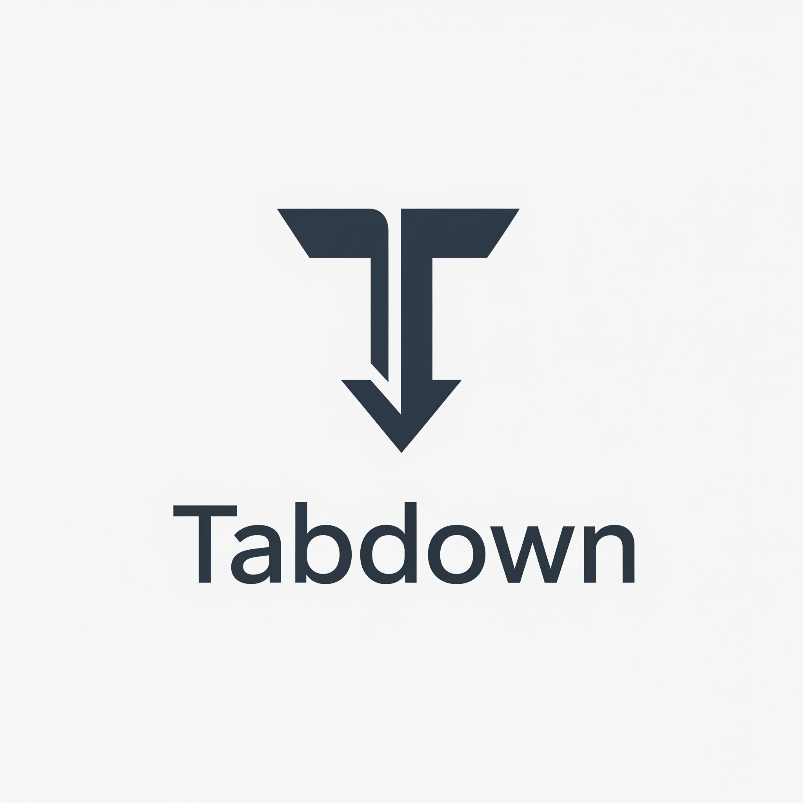

# Tabdown

This is a very simple Chrome extension that downloads all your open tabs into a markdown file.

## Getting started

1. Clone the repository.
1. To load the extension in unpacked developer mode, go to the Extensions page by entering chrome://extensions in a new tab.
    - Alternatively, click the Extensions menu puzzle button and select Manage Extensions at the bottom of the menu.
    - Or, click the Chrome menu, hover over More Tools, then select Extensions.
1. Enable Developer Mode by clicking the toggle switch next to Developer mode.
1. Click the Load unpacked button and select the extension directory.

## Resources
- [Hello World extension tutorial](https://developer.chrome.com/docs/extensions/get-started/tutorial/hello-world)
- [Chrome Tabs API Reference](https://developer.chrome.com/docs/extensions/reference/api/tabs)
