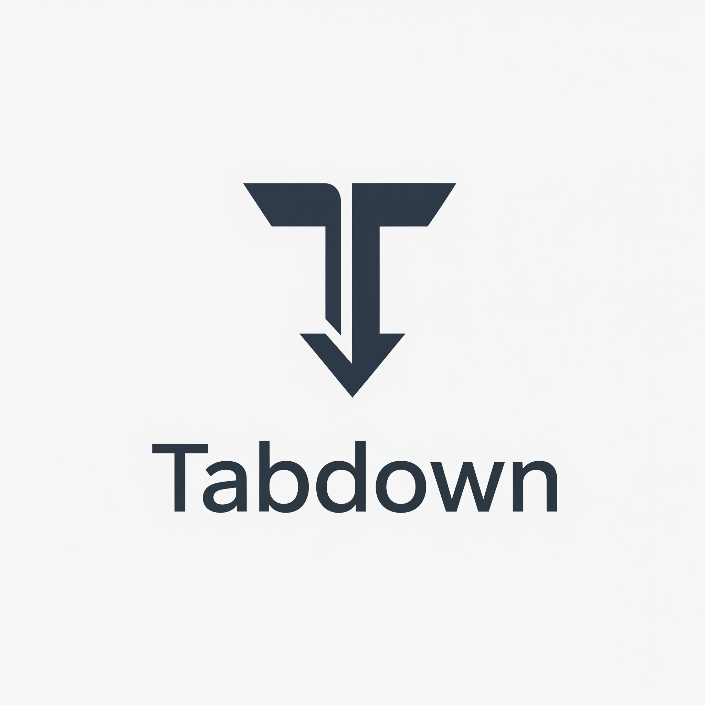
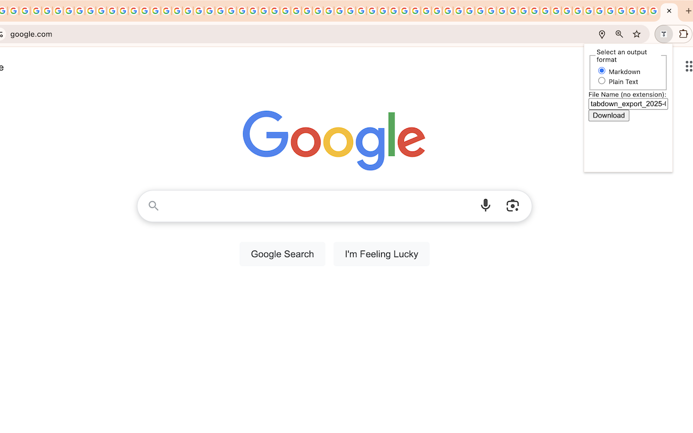
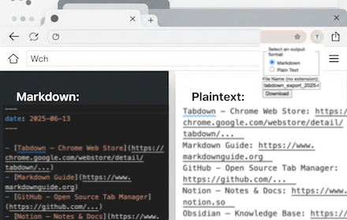

# Tabdown

  

### **Tabdown – Save & Organize Chrome Tabs as Markdown**

Tired of losing track of important browser tabs? **Tabdown** lets you quickly export all your open Chrome tabs into a clean, organized **Markdown-formatted list**—perfect for notes, research, or sharing with colleagues.

Unlike other tab managers, Tabdown focuses on **simplicity and portability**. Instead of complex bookmarking systems, you get a clean Markdown list you can use anywhere—whether you're writing documentation, drafting a report, or just keeping track of your browsing.

  

#### **Key Features**
- ✔ **One-Click Export** – Save all open tabs in the current session (all windows) with a single click.
    - **Markdown**: Simple list of clickable links (`- [Title](URL)`)
    - **Plain Text**: Title and URL per line (`Title: https://...`)
- ✔ **Custom Filename** – Name the file whatever you want.
- ✔ **Lightweight & Fast** – No bloated UI—just a simple popup that gets the job done.

🔗 **Works with**: Notion, Obsidian, Bear, Logseq, GitHub, and any app that supports Markdown or Plain Text.

  

#### **Perfect For**
- 🔹 Researchers saving sources for papers
- 🔹 Developers collecting reference links
- 🔹 Writers organizing research tabs
- 🔹 Students compiling study materials
- 🔹 Anyone who hates losing track of open tabs!

**Free & Open Source** – Tabdown is completely free to use, with no hidden tracking or premium upsells.

📥 **Install Tabdown now** and never lose a tab again!

# Development

## Getting started

1. Clone the repository.
1. To load the extension in unpacked developer mode, go to the Extensions page by entering chrome://extensions in a new tab.
    - Alternatively, click the Extensions menu puzzle button and select Manage Extensions at the bottom of the menu.
    - Or, click the Chrome menu, hover over More Tools, then select Extensions.
1. Enable Developer Mode by clicking the toggle switch next to Developer mode.
1. Click the Load unpacked button and select the extension directory.

## Resources
- [Hello World extension tutorial](https://developer.chrome.com/docs/extensions/get-started/tutorial/hello-world)
- [Chrome Tabs API Reference](https://developer.chrome.com/docs/extensions/reference/api/tabs)
